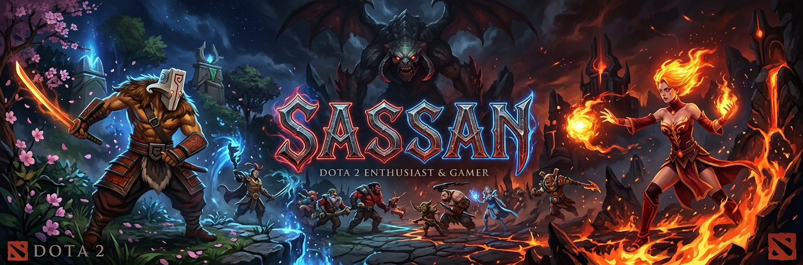
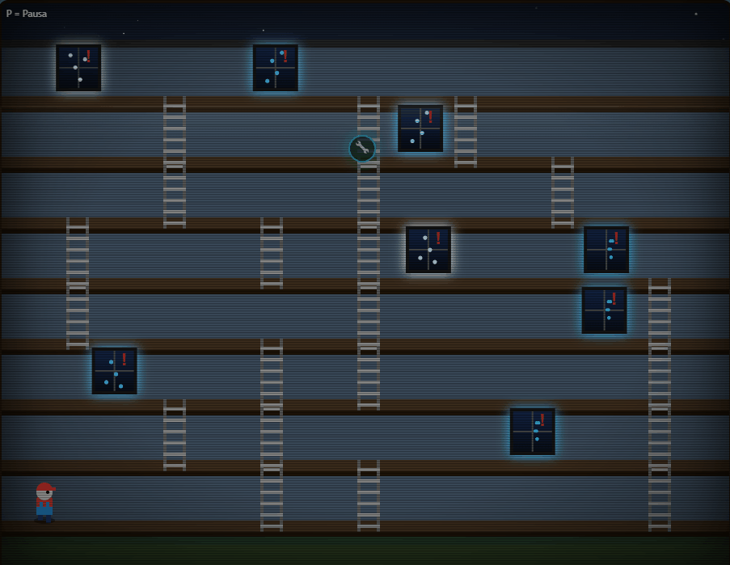
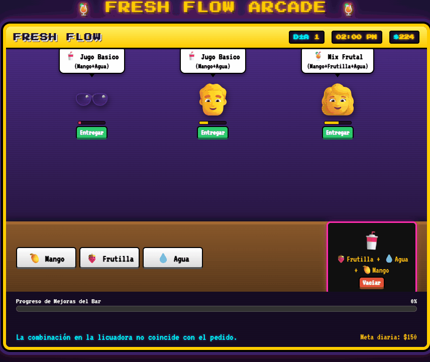
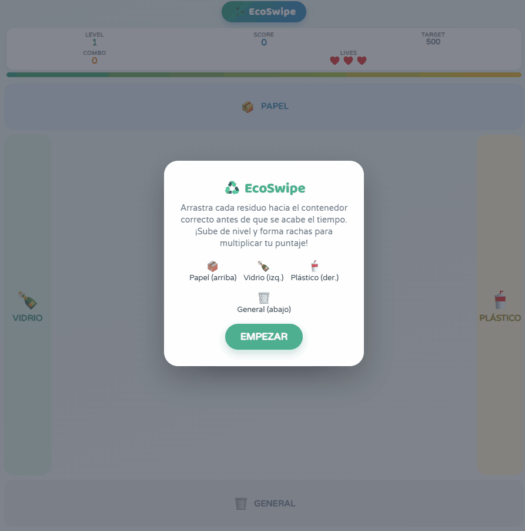
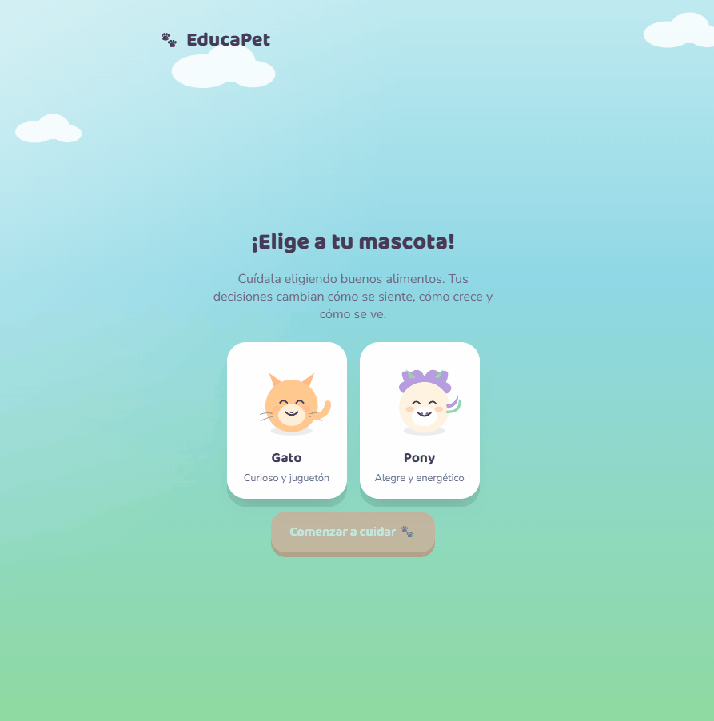
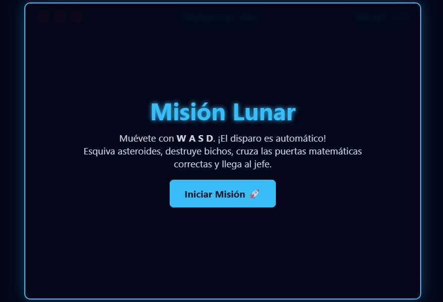
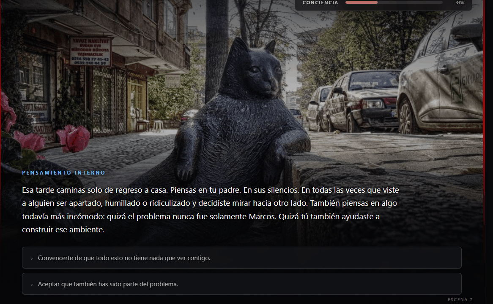

<<<<<<< HEAD
# David — Game Development Portfolio



> Portafolio de prototipos de videojuegos desarrollados con **HTML, CSS y JavaScript** durante la asignatura de Game Development.

**Portafolio interactivo en vivo:** `https://david23444.github.io/game-development-portfolio-A/`


---

## Sobre mí

Soy estudiante de Ingeniería de Sistemas, interesado en desarrollo de videojuegos,
desarrollo web y ciberseguridad. Este repositorio reúne los prototipos jugables que construí
durante las primeras semanas de la asignatura: la mayoría explora educación
ambiental (agua, reciclaje, cuidado animal) y concientización social (bullying),
con mecánicas simples de arcade y gestión. 

- Juegos: `¡Ahórralo, Rubén!`, `FreshFlow`, `EcoSwipe`, `EducaPet`, `Elevador Lunar`, `Bully Redention`.
- Tecnologías: HTML5 Canvas, CSS3, JavaScript vanilla.
- Apoyo de IA: usado para brainstorming de mecánicas, generación de assets visuales de referencia y debugging puntual — el diseño y la implementación del código son propios.

---

## Galería de juegos

| Juego | Vista previa | Género | Tecnología | Jugar / Código |
|---|---|---|---|---|
| **¡Ahórralo, Rubén!** |  | Platformer | JS Canvas | [Jugar](juegos/juego1_!ahorralo_Ruben!/index.html) · [README](juegos/juego1_!ahorralo_Ruben!/README.md) |
| **FreshFlow** |  | Management / Tycoon | JS | [Jugar](juegos/juego2_fresh_flow/index.html) · [README](juegos/juego2_fresh_flow/README.md) |
| **EcoSwipe** |  | Arcade / Clasificación | JS | [Jugar](juegos/juego3_ecoswipe/index.html) · [README](juegos/juego3_ecoswipe/README.md) |
| **EducaPet** |  | Simulation | JS | [Jugar](juegos/juego4_educapet/index.html) · [README](juegos/juego4_educapet/README.md) |
| **Elevador Lunar** |  | Shooter / Educativo | JS Canvas | [Jugar](juegos/juego5_elevador_lunar/index.html) · [README](juegos/juego5_elevador_lunar/README.md) |
| **Bully Redention** |  | Visual Novel | JS | [Jugar](juegos/juego6_bully_redention/index.html) · [README](juegos/juego6_bully_redention/README.md) |

---

## Estructura del repositorio

```text
game-development-portfolio/
├── index.html              # Portafolio interactivo (landing page)
├── README.md               # Este archivo
├── assets/
│   ├── banner.png
│   ├── logo.png
│   ├── capturas/
│   └── gifs/
└── juegos/
    ├── juego1_!ahorralo_Ruben!/
    │   ├── index.html
    │   └── README.md
    ├── juego2_fresh_flow/
    ├── juego3_ecoswipe/
    ├── juego4_educapet/
    ├── juego5_elevador_lunar/
    └── juego6_bully_redention/
```
--
## Como correr el portafolio localmente
    git clone [https://github.com/david23444/game-development-portfolio-A.git](https://github.com/david23444/game-development-portfolio-A.git)
cd game-development-portfolio-A
# abre index.html en el navegador, o usa Live Server en VS Code
--
## Que aprendi/ que mejoraria 
Aprendí: a estructurar múltiples prototipos independientes bajo un mismo repositorio navegable, y a usar GitHub Pages como plataforma de distribución.

Mejoraría: unificar assets compartidos (sprites, sonidos) entre juegos, y agregar un sistema simple de puntuación/progreso persistente por juego.

Hecho por David · Ingeniería de Sistemas
=======
# game-development-portfolio-A