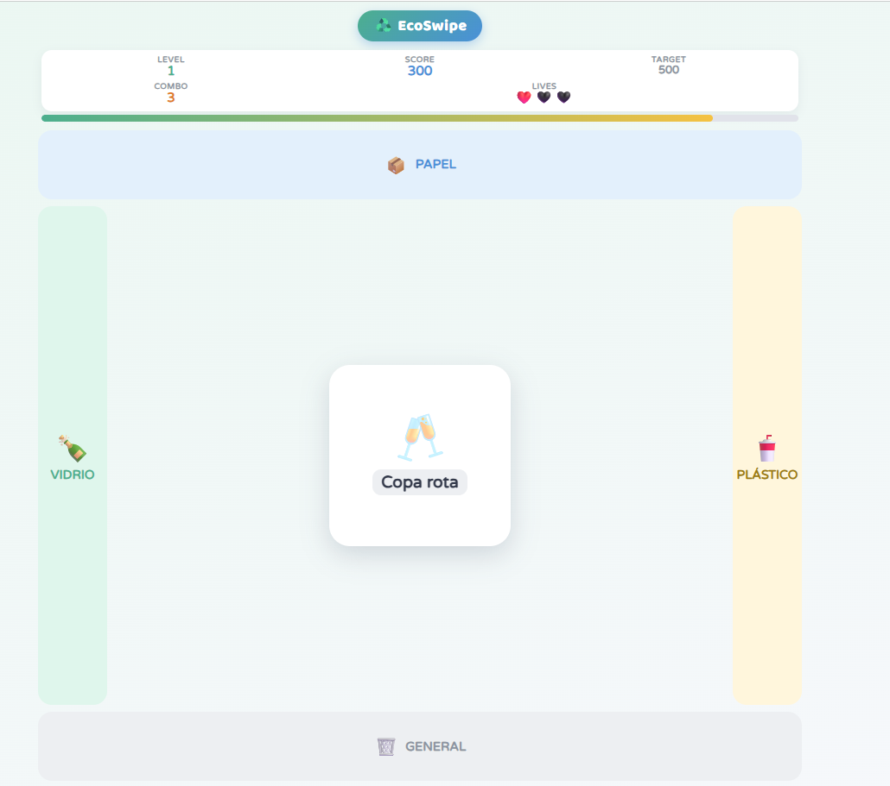

# 🎮 EcoSwipe

## Descripción
En el centro de la pantalla aparece una tarjeta con la imagen de un residuo.
El jugador debe deslizarla en la dirección correcta según el tipo de material.

**Objetivo del jugador:** clasificar correctamente la mayor cantidad de tarjetas
posible antes de quedarse sin vidas.
**Mecánica principal:** swipe direccional bajo presión de tiempo —
arriba = plástico, derecha = papel, izquierda = vidrio/orgánico, abajo = general.
Clasificar bien pasa a la siguiente tarjeta; clasificar mal resta una vida.

## Género
Arcade / Reflejos (clasificación)

## Tecnología
HTML + CSS + JavaScript vanilla

## Controles
| Tecla / Acción | Efecto |
|---|---|
| Swipe arriba / ↑ | Clasificar como plástico |
| Swipe derecha / → | Clasificar como papel |
| Swipe izquierda / ← | Clasificar como vidrio / orgánico |
| Swipe abajo / ↓ | Clasificar como basura general |

## Capturas de pantalla

## Apoyo de IA
Describe brevemente qué partes usaste con apoyo de IA (assets, brainstorming de mecánicas, debugging) y qué hiciste tú.

## Qué aprendí / qué mejoraría
- **Aprendí:** ...
- **Mejoraría:** ...

## Jugar
👉 [Abrir juego](index.html)
