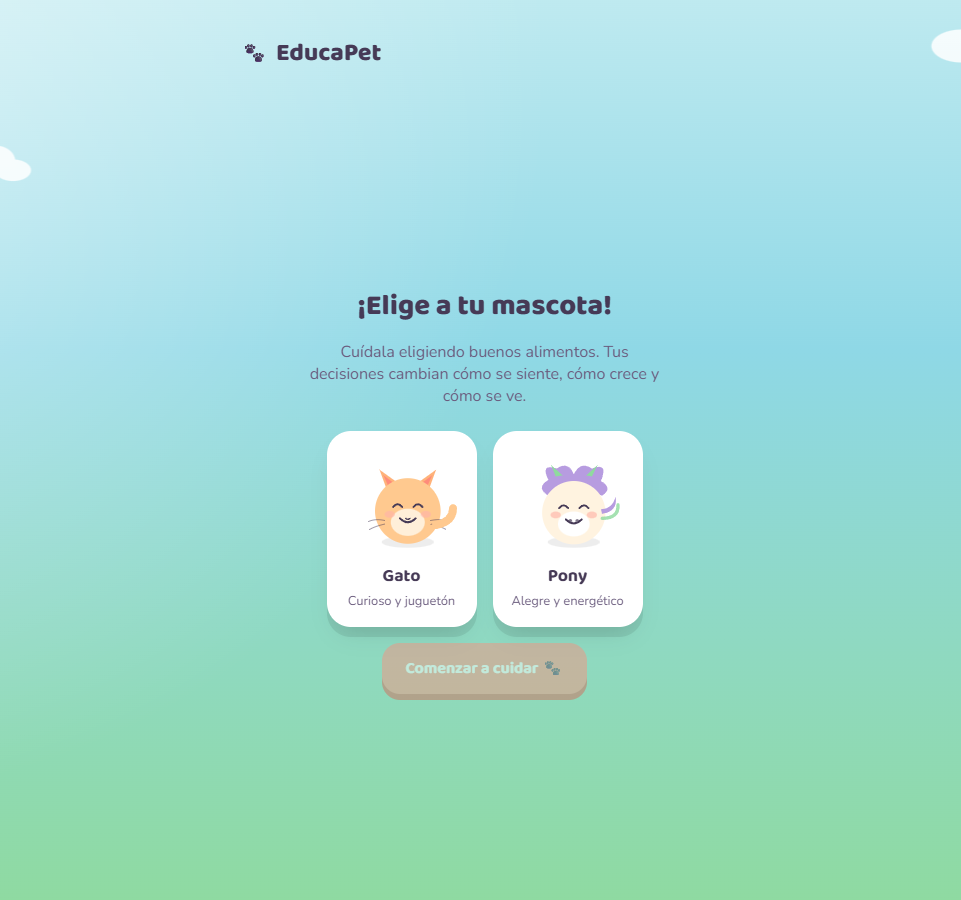
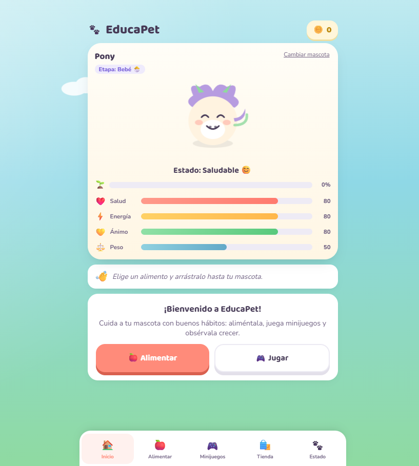

# 🎮 EducaPet

## Descripción
Simulador de cuidado de mascotas donde el jugador gestiona la alimentación, higiene y bienestar de su mascota virtual.

**Objetivo del jugador:** Mantener a la mascota sana y feliz tomando decisiones correctas de cuidado y nutrición.

**Mecánica principal:** Gestión de estadísticas (hambre, energía, salud, ánimo) mediante acciones e interacción directa con la mascota.

## Género
Simulation / Educativo

## Tecnología
HTML + CSS + JavaScript vanilla

## Controles
| Tecla / Acción | Efecto |
|---|---|
| MOUSE / CLICK | Seleccionar acción (alimentar, jugar, bañar, etc.) |
| ESC | Pausa |

## Capturas de pantalla

## Apoyo de IA
- **IA:** Apoyo en brainstorming de mecánicas, generación de assets visuales y resolución de errores puntuales durante el debugging y plasmar el codigo.
.

## Qué aprendí / qué mejoraría
- **Aprendí:** A estructurar el desarrollo por etapas organizadas (identificación del problema, conceptualización de la idea y ejecución modular), además de consolidar la lógica de gestión de estados en JavaScript vanilla.
- **Mejoraría:**
  - Crear una curva de nivel más consistente y progresiva.
  - Implementar una mayor variedad de minijuegos e interacciones.
  - Incorporar animaciones más fluidas para darle mayor dinamismo a la mascota.
  - Profundizar en el apartado dinámico y pedagógico para hacerlo aún más educativo y entretenido.

## Jugar
👉 [Abrir juego](index.html)