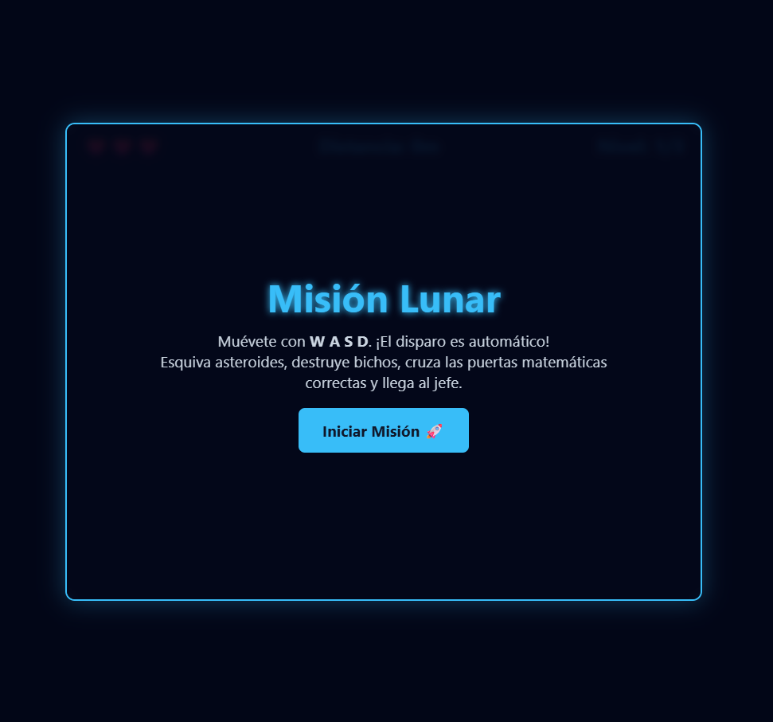
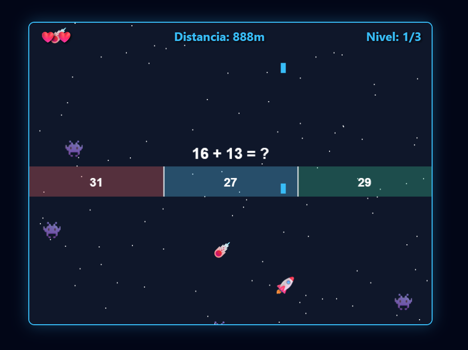

# 🎮 Elevador Lunar

## Descripción
Shooter espacial en el que la nave del jugador avanza en línea recta disparando
automáticamente contra asteroides y enemigos. El nivel no se mide por cantidad
de enemigos eliminados, sino por una distancia fija de recorrido, con
dificultad auto-incremental a medida que se avanza.

**Objetivo del jugador:** completar el recorrido de cada nivel resolviendo
correctamente los desafíos matemáticos que van apareciendo, hasta vencer al
jefe matemático de cada etapa.

**Mecánica principal — 3 capas:**
1. **Recorrido:** la nave dispara sola; el jugador esquiva asteroides mientras avanza.
2. **Mini-preguntas matemáticas:** durante el recorrido aparecen operaciones simples
   (ej. "9 + 3 = ?") con 3 opciones, una correcta. Responder mal resta una vida.
3. **Jefes matemáticos:** al final de cada etapa aparece un jefe que exige responder
   correctamente una serie de preguntas para avanzar — jefe 1 y jefe 2: 3 preguntas
   cada uno; jefe final: 4 preguntas.

**Mejoras entre niveles:** al pasar de nivel se ofrecen 3 mejoras a elegir (ej. disparo doble).
Elegir una mejora dispara un mini-quiz matemático: si se responde bien, se obtiene la mejora;
si se falla, no se otorga.

## Género
Shooter / Educativo (matemáticas)

## Tecnología
HTML5 Canvas + JavaScript vanilla

## Controles
| Tecla / Acción | Efecto |
|---|---|
| ← / → o A / D | Mover la nave |
| 1 / 2 / 3 (o click) | Seleccionar respuesta / mejora |
| ESC | Pausa |

## Capturas de pantalla

## Apoyo de IA
Describe brevemente qué partes usaste con apoyo de IA (assets, brainstorming de mecánicas, debugging) y qué hiciste tú.

## Qué aprendí / qué mejoraría
- **Aprendí:** ...
- **Mejoraría:** ...

## Jugar
👉 [Abrir juego](index.html)
