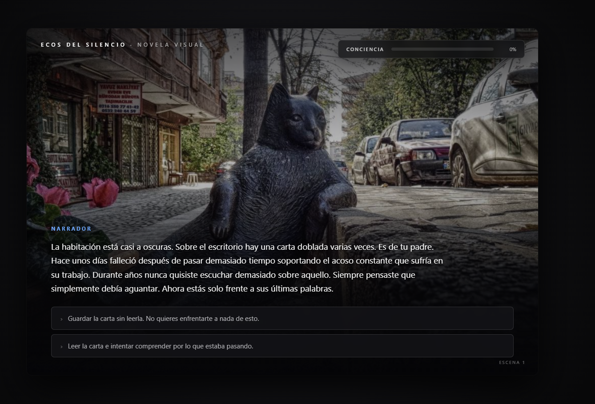

# 🎮 Bully Redention

> ⚠️ **Contenido sensible:** esta historia aborda bullying, acoso laboral y suicidio
> de forma narrativa, con fines de concientización. Recomendado con criterio.

## Descripción
Novela visual sobre un adolescente que sufre bullying en la escuela. La historia
se activa cuando recibe una carta que revela que su padre se quitó la vida tras
sufrir acoso laboral. El juego nace de la necesidad de generar conciencia sobre
el impacto del bullying, tanto en la escuela como en el ámbito laboral.

**Objetivo del jugador:** vivir la historia del protagonista y tomar decisiones
en cada escena (dos opciones por cuadro, ej. "tomar la carta o tirarla").
**Mecánica principal:** narrativa no lineal / ramificada — las decisiones acumuladas
determinan uno de dos finales posibles:
- **Final bueno (redención):** el protagonista deja de reproducir el bullying,
  se convierte en alguien que protege a otros y construye amistades.
- **Final malo (recaída):** el protagonista se endurece y reproduce el ciclo de
  bullying con más agresividad.

El peso de cada decisión es intencional: busca que el jugador sienta la
responsabilidad de sus elecciones en la historia.

## Género
Visual Novel / Narrativa ramificada

## Tecnología
HTML + CSS + JavaScript vanilla

## Controles
| Tecla / Acción | Efecto |
|---|---|
| MOUSE / CLICK | Elegir una de las dos opciones por escena |
| ESPACIO / CLICK | Avanzar diálogo |

## Capturas de pantalla

## Apoyo de IA
Describe brevemente qué partes usaste con apoyo de IA (guion, assets, brainstorming de ramas narrativas) y qué hiciste tú.

## Qué aprendí / qué mejoraría
- **Aprendí:** ...
- **Mejoraría:** ...

## Jugar
👉 [Abrir juego](index.html)
